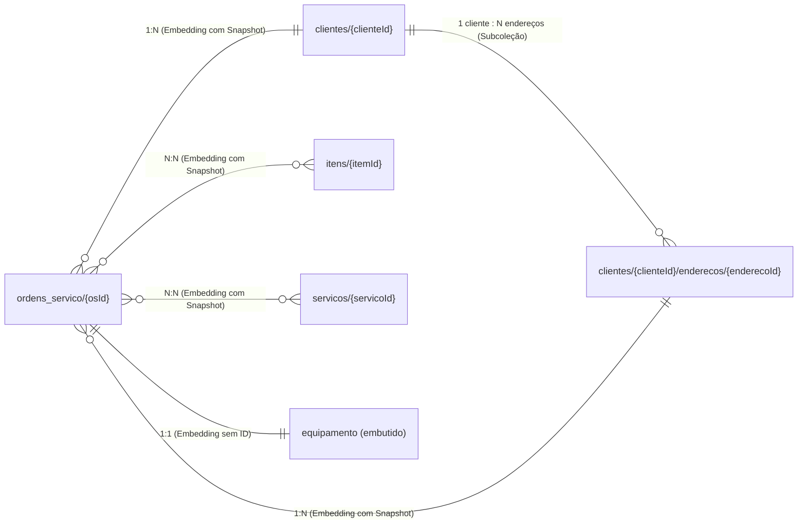

# Schema Firestore ArgOS



- `clientes` -> `enderecos`: 1:N, SUBCOLEÇÃO.
- `ordens_servico` -> `itens`: N:N, EMBEDDING COM SNAPSHOT. A OS copia atributos do item no momento do uso (array `pecas`), e a alteração ou exclusão do item na coleção `itens/{itemId}` não muda OS já gravadas.
- `ordens_servico` -> `servicos`: N:N, EMBEDDING COM SNAPSHOT. Como feito com `itens`
- `ordens_servico` -> `equipamento`: 1:1, EMBEDDING (sem id de origem). Não existe coleção `equipamentos`, o bloco só existe dentro da OS.
- `ordens_servico` -> `clientes`: N:1, EMBEDDING COM SNAPSHOT. A OS copia os campos do cliente e guarda o `id` de origem. Mudar o cliente no cadastro não muda OS já gravadas.
- `ordens_servico` -> `enderecos`: N:1, EMBEDDING COM SNAPSHOT. Mesma lógica, no campo `endereco_servico`. O cliente pode ter N endereços, a OS registra só o que foi usado naquele atendimento.

## Convenções gerais (valem para toda coleção)

| Convenção | Regra |
|---|---|
| Id do registro | UUID gerado no aparelho. Sem sequencial autoincremental — evitaria transação, que exige conexão |
| Dinheiro | Inteiro em centavos, sufixo `_centavos` |
| Datas | Tipo `Timestamp` do Firestore. Não usar string ISO-8601 |
| Auditoria | `created_at`, `updated_at`, `deleted_at` em todo registro |
| Exclusão | Soft delete via `deleted_at`. O documento não é apagado |

### Relacionamentos

#### SUBCOLEÇÕES

As subcoleções são coleções que ficam aninhadas dentro de um documento específico. Se tenho um cliente em `clientes/a3f1c9e2-7b4d-4e8a-9c1f-2d6e5b8a7f30`, guardo os endereços dele em `clientes/a3f1c9e2-7b4d-4e8a-9c1f-2d6e5b8a7f30/enderecos/{enderecoId}`, podendo ter mais de um.

#### EMBEDDINGS (embedding puro, sem id de origem)

Os embeddings consistem na cópia dos dados presentes em um documento em outro documento, quebrando a normalização. O único caso de embedding sem id de origem neste projeto é o `equipamento` (#133, #179). A tela de equipamento grava direto na chave `equipamento`
```json 
{
  "status": "EM_CONSERTO",
  "equipamento": {
    "marca": "Toledo",
    "modelo": "Prix 3 Plus",
    "numero_serie": "TP3-884201",
    "numero_inmetro": "884201",
    "portaria": "Portaria Inmetro 236/1994",
    "numero_verificacao": "V-2026-0142",
    "selo_anterior": "SL-88401",
    "selo_atual": "SL-91277",
    "lacre_anterior": "LC-33120",
    "lacre_atual": "LC-33984"
  },
  ...
}
```
Inserido direto na chave, e não em lista. No máximo um equipamento por OS.

#### EMBEDDING COM SNAPSHOT (guarda o id de origem)

Além de copiar os dados, o documento guarda também o `id` do registro de origem. Isso acontece quando existe uma coleção de verdade por trás do dado copiado. É o caso de `itens`, `servicos`, `clientes` e `enderecos`. O `id` serve pra consulta (`where('peca_id', ...)`) e pra procedência, saber de qual registro aquele dado veio. Se tenho um item de estoque (#172)
```json 
{
  "nome": "Célula de Carga 20kg",
  "descricao": "Célula de carga tipo balança comercial",
  "valor_centavos": 18990
}
```
Ao incluir essa peça numa OS (#176), o array `pecas` guarda os dados copiados e o `peca_id` de origem
```json 
{
  "status": "EM_CONSERTO",
  "pecas": [
    {
      "peca_id": "b4e2a7c9-1d3f-4a8b-9c5e-2f6d7b1a3e40",
      "nome": "Célula de Carga 20kg",
      "quantidade": 2,
      "valor_unitario_centavos": 18990,
      "desconto_centavos": 0
    },
    ...
  ],
  ...
}
```
A OS mantém essa cópia congelada mesmo que o item mude de preço ou seja excluído do catálogo depois.


## Coleção `clientes/{clienteId}`

| Campo | Tipo | Obrigatório | Origem |
|---|---|---|---|
| `nome` | string | sim | Tela pessoa |
| `tipo_pessoa` | string | sim | Tela pessoa. `FISICA` ou `JURIDICA` |
| `documento` | string | sim | Tela pessoa. CPF ou CNPJ, somente dígitos |
| `telefone` | string | sim | Tela contato |
| `email` | string | não | Tela contato |
| `contato_adicional` | string | não | Tela contato |
| `setor` | string | não | Tela contato |
| `observacoes` | string | não | Tela contato |
| `created_at` | Timestamp | sim | Servidor |
| `updated_at` | Timestamp | sim | Servidor |
| `deleted_at` | Timestamp | não | Servidor, nulo enquanto o cliente estiver ativo |

Notas:

- `tipo_pessoa` substitui a herança `PessoaFisica`/`PessoaJuridica`, que não mapeia bem para documento sem schema. A tarefa técnica da #170 remove essas duas classes do código.
- `documento` guarda CPF **ou** CNPJ. Validação cruzada com `tipo_pessoa`: 11 dígitos se `FISICA`, 14 se `JURIDICA` (critério da #170).


## Subcoleção `clientes/{clienteId}/enderecos/{enderecoId}`

Origem: `EPC09 - HU01` (#170).

| Campo | Tipo | Obrigatório | Origem |
|---|---|---|---|
| `cep` | string | não | Tela endereço |
| `logradouro` | string | sim | Tela endereço |
| `numero` | string | não | Tela endereço |
| `complemento` | string | não | Tela endereço |
| `cidade` | string | sim | Tela endereço |
| `uf` | string | sim | Tela endereço |
| `created_at` | Timestamp | sim | Servidor |
| `updated_at` | Timestamp | sim | Servidor |
| `deleted_at` | Timestamp | não | Nulo enquanto o endereço estiver ativo |


## Coleção `itens/{itemId}`

Origem: `EPC09 - HU02` (#172).

| Campo | Tipo | Obrigatório | Origem |
|---|---|---|---|
| `nome` | string | sim | Tela de produto |
| `descricao` | string | não | Tela de produto. Limite de 50 caracteres |
| `valor_centavos` | int | sim | Tela de produto |
| `quantidade_minima` | int | sim | Tela de produto |
| `tipo` | string | sim | Tela de produto. `PECAS` ou `BALANCAS` |
| `created_at` | Timestamp | sim | Servidor |
| `updated_at` | Timestamp | sim | Servidor |
| `deleted_at` | Timestamp | não | Nulo enquanto o item estiver ativo |

Notas:

- `itens` cobre produto de estoque, peça ou balança à venda, conforme `tipo`. Não é o mesmo conceito que `equipamento` (balança que entra pra conserto, objeto embutido na OS, sem id próprio).
- `valor_centavos` converte para reais pela classe `Dinheiro`, entregue pela #168.
- A OS copia nome e `valor_centavos` do item no array `pecas` no momento do uso. Alterar ou excluir o item no catálogo não muda OS já gravadas.

---

## Coleção `servicos/{servicoId}`

Origem: `EPC09 - HU03` (#173, fechada).

| Campo | Tipo | Obrigatório | Origem |
|---|---|---|---|
| `nome` | string | sim | Tela de serviço |
| `descricao` | string | não | Tela de serviço. Limite de 50 caracteres |
| `valor_centavos` | int | sim | Tela de serviço |
| `created_at` | Timestamp | sim | Servidor |
| `updated_at` | Timestamp | sim | Servidor |
| `deleted_at` | Timestamp | não | Nulo enquanto o serviço estiver ativo |

Notas:

- `valor_centavos` converte para reais pela classe `Dinheiro`, entregue pela #168.
- A OS copia nome e `valor_centavos` do serviço no array `servicos` no momento do uso. Excluir o serviço no catálogo não muda OS já gravadas.
- `deleted_at` existe desde já no schema, mesmo a HU de exclusão (#93) ainda não estando implementada.


## Bloco `equipamento` (embutido na coleção `ordens_servico/{osId}`)

Origem: `EPC09 - HU08` (#179). Campos definidos na #133.

| Campo | Tipo | Obrigatório | Origem |
|---|---|---|---|
| `marca` | string | sim | Tela de equipamento |
| `modelo` | string | sim | Tela de equipamento |
| `numero_serie` | string | sim | Tela de equipamento |
| `numero_inmetro` | string | sim | Tela de equipamento |
| `portaria` | string | sim | Tela de equipamento |
| `numero_verificacao` | string | sim | Tela de equipamento |
| `selo_anterior` | string | sim | Tela de equipamento |
| `selo_atual` | string | sim | Tela de equipamento |
| `lacre_anterior` | string | sim | Tela de equipamento |
| `lacre_atual` | string | sim | Tela de equipamento |

Notas:

- O equipamento é um objeto embutido na ordem de serviço. O equipamento não forma uma coleção separada.
- A tela de equipamento desabilita todos os campos quando a ordem de serviço está no status `ENTREGUE` ou `PAGA`.

## Coleção `ordens_servico/{osId}`

Origem: `EPC09 - HU04, HU05, HU06, HU07, HU09` (#174, #176, #177, #178, #180). O id do registro é um UUID gerado no aparelho.

### Campos do documento principal

| Campo | Tipo | Obrigatório | Origem |
|---|---|---|---|
| `status` | string | sim | Enum de status |
| `status_antes_cancelamento` | string | não | Sistema. Guarda o status anterior quando a OS é cancelada |
| `equipamento_bloqueado` | bool | sim | Sistema. Começa como `false` |
| `data_entrada` | Timestamp | sim | Aba Dados. Padrão é a data atual |
| `data_saida` | Timestamp | não | Sistema. Nula até a OS sair da oficina |
| `relatorio` | string | não | Área de texto. Limite de 256 caracteres |
| `created_at` | Timestamp | sim | Servidor |
| `updated_at` | Timestamp | sim | Servidor |
| `deleted_at` | Timestamp | não | Nulo enquanto a OS estiver ativa |
| `executor` | map | sim | Constante do app |
| `permissionaria` | map | sim | Constante do app |
| `cliente` | map | sim | Snapshot, copiado do cadastro |
| `endereco_servico` | map | sim | Snapshot, copiado do cadastro |
| `equipamento` | map | sim | Digitado na tela de equipamento (ver bloco acima) |
| `pecas` | array | sim | Snapshot, array. Vazio se o técnico não adicionar nada |
| `servicos` | array | sim | Snapshot, array. Vazio se o técnico não adicionar nada |
| `valores` | map | sim | Calculado a partir de `pecas` e `servicos` |

### Valores do campo `status`

| Valor | Como a OS chega nele |
|---|---|
| `EM_ORCAMENTO` | Dropdown da aba Dados |
| `EM_CONSERTO` | Dropdown da aba Dados |
| `ENTREGUE` | Dropdown da aba Dados |
| `PAGA` | Dropdown da aba Dados |
| `CONCLUIDA` | Botão "Concluir OS e voltar" da aba Valores (#87) |
| `CANCELADA` | Botão de cancelar da aba Valores (#47) |

### Bloco `executor`

| Campo | Tipo | Obrigatório |
|---|---|---|
| `id` | string | sim |
| `nome` | string | sim |
| `documento_identidade` | string | não |

### Bloco `permissionaria`

| Campo | Tipo | Obrigatório |
|---|---|---|
| `id` | string | sim |
| `nome_empresarial` | string | sim |
| `cnpj` | string | sim |
| `telefone` | string | sim |
| `email` | string | não |
| `endereco` | map | sim |

O map `endereco` tem `logradouro`, `numero`, `cidade`, `uf` e `cep`.

### Bloco `cliente` (snapshot)

| Campo | Tipo | Obrigatório | Origem |
|---|---|---|---|
| `id` | string | sim | Id do registro na coleção `clientes` |
| `nome` | string | sim | Cópia |
| `tipo_pessoa` | string | sim | Cópia. `FISICA` ou `JURIDICA` |
| `documento` | string | sim | Cópia do CPF ou CNPJ |
| `telefone` | string | sim | Cópia |
| `email` | string | não | Cópia |

### Bloco `endereco_servico` (snapshot)

| Campo | Tipo | Obrigatório | Origem |
|---|---|---|---|
| `id` | string | sim | Id do registro na subcoleção `enderecos` |
| `logradouro` | string | sim | Cópia |
| `numero` | string | não | Cópia |
| `complemento` | string | não | Cópia |
| `cidade` | string | sim | Cópia |
| `uf` | string | sim | Cópia |
| `cep` | string | não | Cópia |

### Elemento do array `pecas`

| Campo | Tipo | Obrigatório | Origem |
|---|---|---|---|
| `peca_id` | string | sim | Id do registro na coleção `itens` |
| `nome` | string | sim | Cópia do nome do item |
| `quantidade` | int | sim | Seletor da aba Peças. Mínimo 1 |
| `valor_unitario_centavos` | int | sim | Cópia do valor do item |
| `desconto_centavos` | int | sim | Aba Peças. Grava zero — nenhuma tela preenche ainda (#183) |

### Elemento do array `servicos`

| Campo | Tipo | Obrigatório | Origem |
|---|---|---|---|
| `servico_id` | string | sim | Id do registro na coleção `servicos` |
| `descricao` | string | sim | Cópia do nome do serviço |
| `valor_centavos` | int | sim | Cópia do valor do serviço |
| `desconto_centavos` | int | sim | Aba Serviços. Grava zero — nenhuma tela preenche ainda (#183) |

Sem campo de quantidade — serviço não tem quantidade (#102).

### Bloco `valores`

| Campo | Tipo | Obrigatório | Origem |
|---|---|---|---|
| `subtotal_pecas_centavos` | int | sim | Soma de `quantidade` × `valor_unitario_centavos` por peça, menos desconto |
| `subtotal_servicos_centavos` | int | sim | Soma de `valor_centavos` por serviço, menos desconto |
| `taxa_global_centavos` | int | sim | Campo "Taxas" da aba Valores |
| `desconto_global_centavos` | int | sim | Campo "Descontos" da aba Valores |
| `total_centavos` | int | sim | Subtotais + taxa global − desconto global. Nunca negativo |

### Regra de bloqueio e datas de entrada/saída

- `equipamento_bloqueado` vira `true` na primeira vez que `status` chega em `ENTREGUE` ou `PAGA`. O campo nunca volta a `false` — o bloqueio sobrevive à reabertura da OS (#142, #180).
- `data_saida` é preenchido pela mesma transição. Uma transição posterior não sobrescreve o valor. `CONCLUIDA` não preenche `data_saida` — pela #87, `CONCLUIDA` significa "terminei de preencher", não "o equipamento saiu".
- `data_saida` é corrigível por modal. O modal troca a data, mas nunca a apaga.
- A transição para `CANCELADA` grava o status anterior em `status_antes_cancelamento`. `CANCELADA` não preenche `deleted_at` nem `data_saida` — a OS cancelada continua visível na listagem, com uma tag (#47).

### Índices compostos

Na coleção `ordens_servico`:

- `cliente.id` ASC + `data_entrada` DESC
- `status` ASC + `data_entrada` DESC
- `status` ASC + `cliente.id` ASC + `data_entrada` DESC

### Pendências

- `desconto_centavos` grava zero em `pecas` e `servicos` até existir tela que o preencha (#183).
- `executor.documento_identidade` grava string vazia — nenhuma tela coleta (#182).
- Assinatura do executor fora do MVP — OS digital não atende integralmente o item 5.12.2 "e" da Portaria 457.

